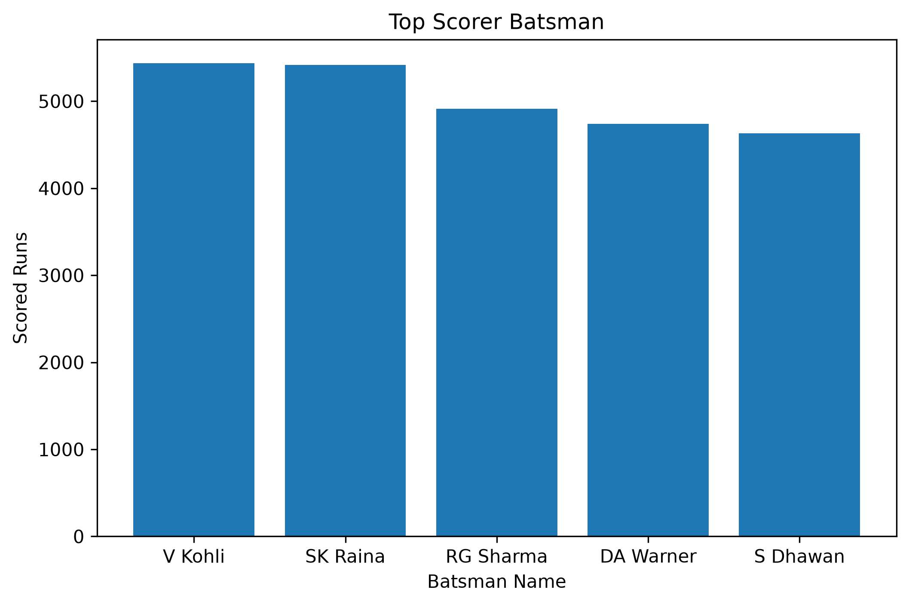
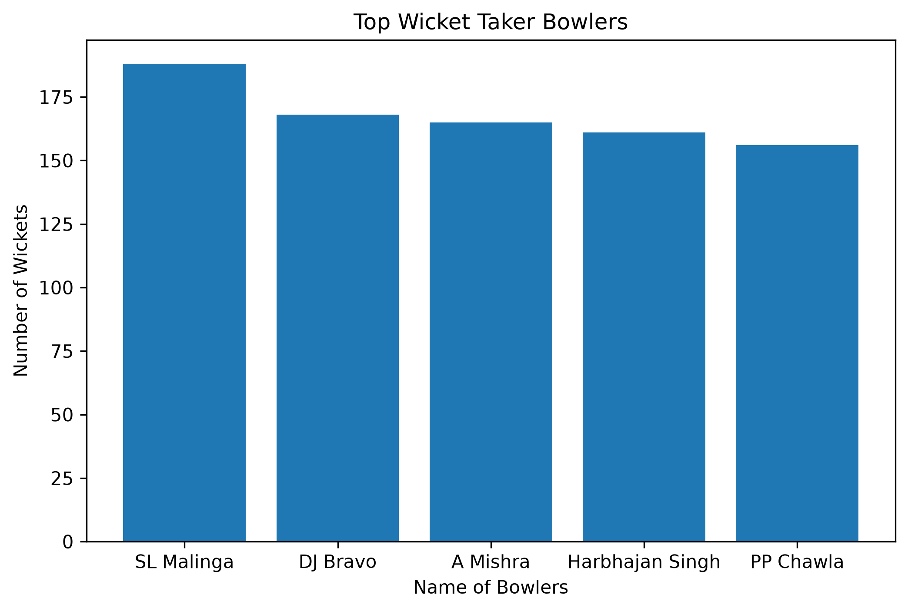
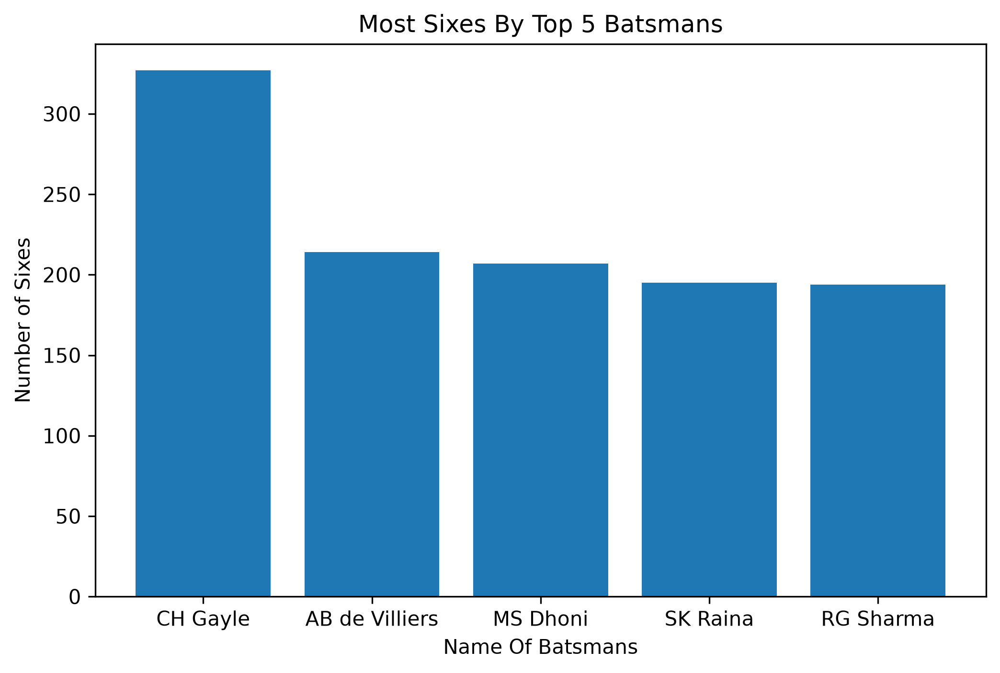
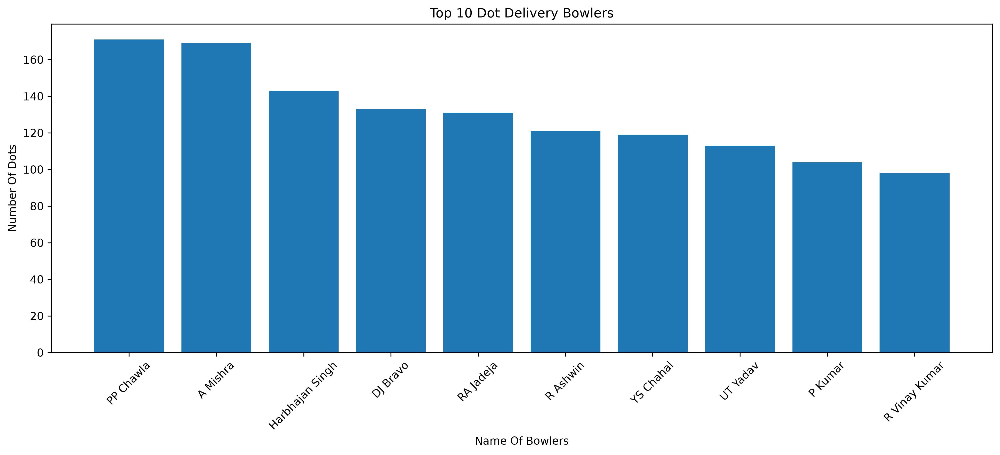
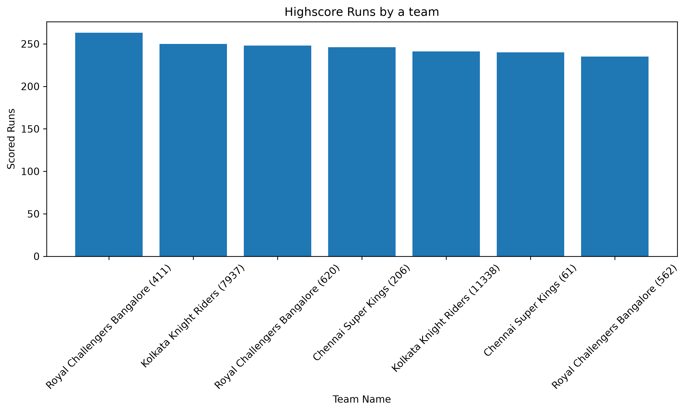
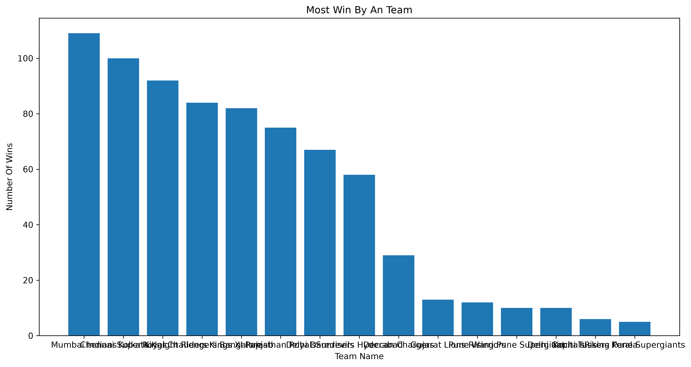
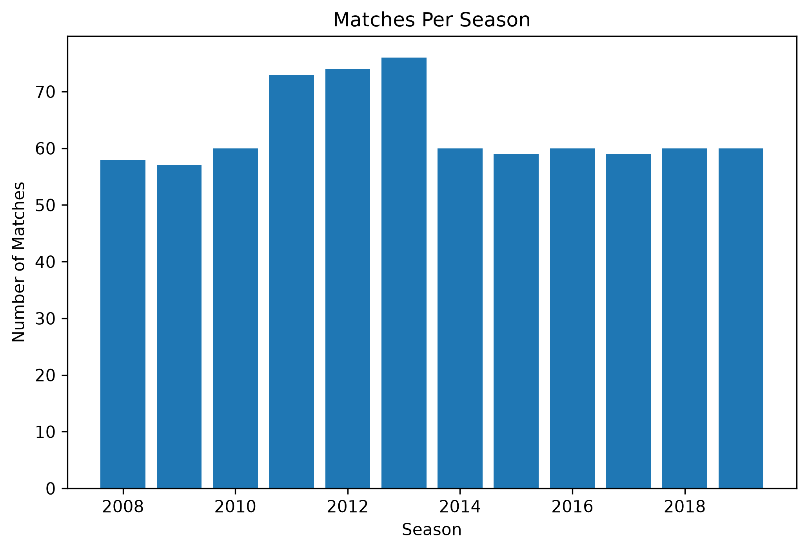
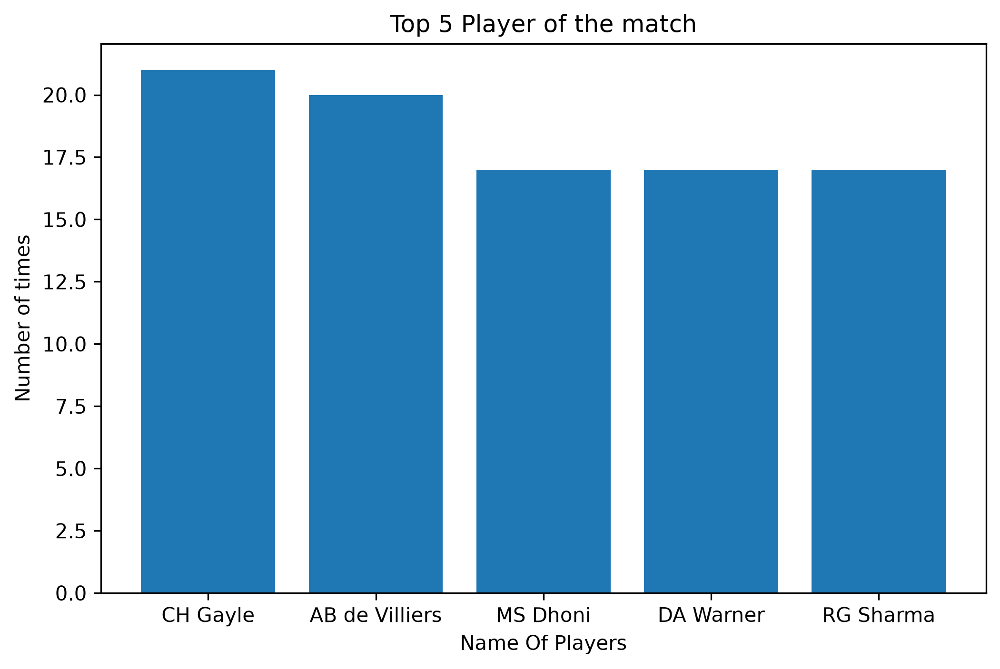

# 🏏 IPL Data Analysis using Python

A beginner-friendly Data Analysis project built using **Python**, **Pandas**, and **Matplotlib**. This project explores IPL match and ball-by-ball data to extract useful insights and visualize them through graphs.

---

## 📌 Project Overview

This project analyzes IPL datasets (`matches.csv` and `deliveries.csv`) to discover player and team performance statistics using data analysis techniques.

---

## 📂 Dataset

- matches.csv
- deliveries.csv

---

## 🛠️ Technologies Used

- Python
- Pandas
- Matplotlib

---

## 📊 Analysis Performed

- 🏏 Top Run Scorers
- 🎯 Top Wicket Takers
- 💥 Most Sixes
- ⚪ Most Dot Ball Bowlers
- ➕ Most Extras Given
- 🏆 Highest Team Score
- 🏅 Player of the Match Analysis
- 📅 Matches Played Per Season
- ✅ Team Wins Analysis

---

## 📈 Visualizations

### 🏏 Top Run Scorers



---

### 🎯 Top Wicket Takers



---

### 💥 Most Sixes



---

### ⚪ Most Dot Ball Bowlers



---

### 🏆 Highest Team Score



---

### 🏅 Team Wins



---

### 📅 Matches Per Season



---

### ⭐ Player of the Match



## 📁 Project Structure

```
IPL-Data-Analysis/
│
├── IPL_Data_Analysis.py
├── matches.csv
├── deliveries.csv
├── Top5_batsman.png
├── top_wkt_tkr.png
├── Most_sixes.png
├── most_dot_balls.png
├── high_score.png
├── Team_wins.png
├── matches_per_season.png
├── player_of_match.png
└── README.md
```

---

## 🚀 How to Run

1. Clone this repository

```bash
git clone https://github.com/your-username/IPL-Data-Analysis.git
```

2. Install required libraries

```bash
pip install pandas matplotlib
```

3. Run the project

```bash
python IPL_Data_Analysis.py
```

---

## 🎯 Learning Outcome

Through this project I practiced:

- Data Cleaning
- Data Filtering
- GroupBy Operations
- Aggregation
- Sorting
- Data Visualization
- Real-world IPL Data Analysis

---

## 👨‍💻 Author

**Pankaj Pareek**

Aspiring Data Scientist | Python | Pandas | SQL | Power BI

⭐ If you found this project useful, don't forget to give it a star!
